# 교육공학 이론으로 본 학회 디지털 서비스 — yonsei-edtech 사례 분석

대학원 교육공학 학회의 디지털 운영 인프라를 교육공학 이론 관점에서 분석한 석사 수준 사례 연구

> **저자**: (저자)
> **소속**: 연세대학교 교육대학원 교육공학전공
> **사이트**: yonsei-edtech (https://yonsei-edtech.vercel.app)
> **버전**: v6 — 석사 수준 사례 분석으로 정체성 재편 (TID 신개념 정의 제거, framework synthesis 표현 단순화, 결론 3단 명제 톤다운, 후속 트랙 6→3 압축, 부록 D·E 단순화). v5의 본문 자료는 보존하되 학위 논문 형식으로 톤·구조 조정
> **연락**: education@yonsei.ac.kr

---

## 국문 초록 (Abstract)

이 연구는 한 대학원 교육공학 학회가 운영하는 디지털 서비스(yonsei-edtech)를 교육공학 이론 관점에서 분석한 단일 사례 연구이다. 학회 운영진(석사·박사과정생 중심)이 7개월에 걸쳐 자체 설계·구현한 서비스가 자기조절학습, 자기결정성 이론, 인지부하 이론, 다중매체 학습 이론, 실천공동체, 인지 도제, 분산 인지, 형성평가, 자기효능감·게이미피케이션, 개방 과학·절차적 정의의 열 가지 교육공학 이론을 어떻게 디자인 결정에 반영하였는지를, 사이트 소스 코드(약 5만 라인, 약 290개 컴포넌트)와 30건의 설계 문서 분석을 통해 정리한다. 서비스의 9개 기능 도메인(학회 운영·공동 연구·연구지 출판·공동 작성·학습 잔디·CoP 계보·기여도 매트릭스·학회보·게임화)에 대해 10개 이론의 적용 양상을 4단계 강도(핵심·중요·부분·잠재)로 매핑한 후, 시너지·긴장·보완의 세 패턴을 사례별로 정리하였다. 분석 결과 동기 관련 이론(자기결정성 이론·자기효능감·게이미피케이션·자기조절학습)이 서비스 전반에 폭넓게 적용된 반면, 인지 관련 이론은 출판 마법사·공동 작성 같은 특정 과제에 응집되어 있음을 확인하였다. 본 연구는 학회·기관 차원 학술 디지털 서비스 설계의 교육공학 이론 적용 사례를 정리한다는 점에서 의의가 있으며, 디자인 합리화 관점에서 향후 활용 가능한 기초 자료를 제공한다.

**키워드**: 교육공학 이론, 사례 연구, 학회 디지털 서비스, 디자인 합리화, yonsei-edtech

---

## English Abstract

This single-case study analyzes a digital service (yonsei-edtech) operated by a graduate-level educational technology society, examining how ten core educational technology theories (Self-Regulated Learning, Self-Determination Theory, Cognitive Load Theory, Cognitive Theory of Multimedia Learning, Communities of Practice, Cognitive Apprenticeship, Distributed Cognition, Formative Assessment, Self-Efficacy and Gamification, and Open Science and Procedural Justice) were reflected in design decisions over seven months of development. The analysis is based on source code review (≈50,000 LOC, ≈290 components) and 30 design documents. Across nine functional domains, the application of each theory is mapped under a four-level strength rubric, and three types of theory interaction (synergy, tension, complementarity) are documented through six illustrative cases. Results show that motivation-oriented theories are broadly applied across the service, whereas cognitive theories are concentrated in specific task-bound domains such as the publication wizard. The study contributes a documented case of educational technology theory application to graduate-society digital infrastructure design.

**Keywords**: Educational Technology Theory, Case Study, Academic Society Digital Service, Design Rationale, yonsei-edtech

---

## 1. 서론 (Introduction)

학습관리시스템(LMS)·온라인 학습환경의 설계는 교육공학의 핵심 응용 영역으로 자리 잡았으며, 자기조절학습(Zimmerman, 2002), 자기결정성 이론(Deci & Ryan, 2000), 인지부하 이론(Sweller, 1988) 등 단일 이론을 디자인 원리로 채택한 연구가 누적되어 왔다. 모바일 학습 환경에 대한 Crompton과 Burke(2018)의 systematic review는 행동주의 접근(약 40%)과 단일 학습 이론에 의존한 설계가 다수를 차지하였고, 복수 이론을 명시적으로 통합한 사례는 드물게 보고되었음을 보여 준다. 그러나 실제 학회·기관·대학원 차원의 디지털 인프라는 단일 이론으로 환원되지 않는다. 운영진은 학습자의 자기조절을 지원하면서도 동시에 인지 부하를 통제하고, 학자 정체성을 형성하면서 출판 윤리를 보호해야 한다.

이러한 다중 요구를 동시에 충족하기 위해서는 여러 이론을 통합적으로 적용하는 디자인이 필요하지만, 실제로 어떻게 통합되는지에 대한 체계적 사례 보고는 드물다. Reeves(2006)는 단일 이론으로는 복합 학습 환경의 디자인 합리화가 불충분함을 지적하였고, Bell(2004)은 이론 통합 연구의 방법론적 도전을 명시하였으나, 통합 자체의 패턴을 매트릭스로 가시화한 연구는 본 저자가 검색한 범위 내에서 확인되지 않았다.

본 연구는 한 대학원 교육공학 학회가 자체적으로 구축·운영하는 디지털 인프라 사이트(yonsei-edtech, 이하 본 사이트)를 분석 대상으로 삼아, 10개의 교육공학 이론이 9개의 사이트 도메인에 동시에 구현되는 통합 패턴을 매트릭스로 제시하고, 통합도를 정량화하여 분석하고자 한다.

사례는 몇 가지 점에서 특수하다. 사이트는 단일 LMS가 아니라 학회 운영 전반을 지원하는 SaaS이며, 학습·연구·출판·운영의 다층 활동을 한 공간 안에서 수용한다. 운영 주체가 학회 회원(대학원생·운영진·졸업생)이라는 점도 일반적인 학습환경 연구와 결을 달리한다. 학습자 자체가 디자인 결정의 주체이기도 하기 때문이다. 무엇보다 사이트는 7개월의 PDCA 사이클(75개 이상의 Sprint, 약 1,200건의 commit)을 통해 점진적으로 진화한 산물로, 각 기능의 도입 동기가 설계 문서에 그대로 남아 있다. 디자인 합리화 분석에 드물게 적합한 조건이다.

본 연구는 학회·기관 차원 학술 디지털 서비스의 교육공학 이론 적용 사례를 정리한다는 점에서 의의가 있다. 다음 세 가지를 다룬다. 첫째, 서비스의 9개 기능 도메인 위에서 10개 교육공학 이론이 어떻게 적용되었는지를 4단계 강도로 매핑한 결과를 표로 정리한다. 둘째, 이론 간 시너지·긴장·보완의 세 패턴을 사례 6건을 통해 보여 준다. 셋째, 본 분석이 학회·기관의 디지털 서비스 설계 실무에 어떤 시사를 주는지를 정리한다.

저자는 사이트의 운영진으로 활동하였다. 이는 사례에 대한 깊은 이해를 제공하지만 동시에 자기 정당화 편향의 위험을 동반한다. 분석의 주관성을 통제하기 위해 코드·설계 문서·운영진 인터뷰의 세 자료원을 교차 검증하였다(부록 B).

---

## 2. 관련 연구 (Literature Review)

### 2.1 단일 이론 기반 디지털 학습환경 연구

지난 20년간 단일 이론을 적용한 디지털 학습환경 연구는 상당한 누적을 보였다. 자기조절학습(SRL) 기반 LMS 연구는 학습 분석 대시보드(Schwendimann et al., 2017), 목표 설정 기능(Pérez-Álvarez et al., 2018), 자기성찰 프롬프트(Bannert et al., 2014) 등을 중심으로 발전했다. Bannert et al.(2014)의 process mining 연구는 SRL의 3-phase 모형이 실제 학습자 행동 시퀀스로 어떻게 나타나는지 정량 분석하였다.

자기결정성 이론(SDT)은 게이미피케이션 연구와 결합해 자율성 지원 디자인의 효과를 보고해왔다. Sailer et al.(2017)은 게임 디자인 요소별 심리적 욕구 충족 효과를 실험적으로 검증하였고, Sailer와 Homner(2020)의 메타분석은 게이미피케이션의 인지적·동기적 학습 결과에 대한 평균 효과 크기를 보고하였다. 그러나 Hanus와 Fox(2015)는 종단 연구에서 일부 게임 요소가 내재 동기를 감소시킬 수 있음을 지적하여, 자율성 지원의 세심한 디자인의 필요성을 시사하였다.

인지부하 이론(CLT)은 멀티미디어 학습환경의 화면 구성·세분화 원리로 작용했다. Mayer와 Moreno(2003)는 인지 부하를 줄이는 9가지 원리를 제시하였고, van Merriënboer와 Sweller(2005)는 복합 학습에서 CLT의 적용 방법을 체계화하였다. 다중매체 학습 이론(CTML)은 Mayer(2021)의 3판에서 dual channel·limited capacity·active processing 가정을 확립하였다.

이들 연구는 단일 이론의 응용 가능성을 입증했지만, 실제 학습환경은 다수의 이론이 동시에 작동한다는 점에서 한계가 있다(Reeves, 2006). 한 디자인 결정이 여러 이론에 동시에 부합할 수 있으며, 때로는 이론 간 충돌이 발생하기도 한다.

### 2.2 학회·기관 차원의 디지털 인프라 사례

학회·기관 차원의 디지털 인프라 구축 사례는 해외에서 일부 보고되었다. OpenStax의 개방형 교과서 플랫폼 구축, AECT의 학회 홈페이지·연차대회 디지털 운영 등은 학회·기관이 자체적으로 학술 인프라를 디지털화한 사례이다. 그러나 이들은 주로 출판 또는 자료 공유에 한정되며, 학회 운영·학습공동체·학자 정체성 형성·연구 협업을 통합한 사례는 드물다.

학회 차원의 데이터 거버넌스 측면에서 Nosek et al.(2015)은 개방 과학의 8개 표준 실천을 제안하였고, Allen et al.(2014)은 CRediT 14역할 분류체계를 도입하였다. 절차적 정의의 학술 적용은 Tyler(1988)의 voice·neutrality·trust·standing 4 차원에 기반하여 학술 출판 의사결정의 공정성 평가에 활용된다.

국내에서는 학회 차원의 디지털 인프라에 대한 학술적 분석이 본 저자가 검색한 범위에서 매우 드물다. 사례는 국내 학회 환경에서 이론 통합 인프라의 첫 보고에 해당할 수 있다.

### 2.3 이론 통합 연구의 방법론적 도전

복수 이론의 적용을 사례 단위로 분석할 때에는 이론 간 개념적 호환성, 매핑 강도의 평가 기준, 이론 간 상호작용의 식별이라는 세 가지 과제가 있다(Bell, 2004). 본 연구는 사전 정의된 교육공학 이론을 분석의 렌즈로 삼되, 사례에서 새로운 패턴이 드러나면 함께 정리하는 방식으로 진행하였다.

매핑 강도의 평가는 디자인 합리화 사례 연구에서 평가자의 주관성에 의존하기 쉽다. 이를 완화하기 위해 본 연구는 4단계 평가 기준(§3.3)을 명시하고, 코드·설계 문서·운영진 인터뷰의 세 자료원을 교차 검증하는 절차를 적용하였다(부록 B). 단일 평가자 구조의 한계는 §5.5에 명시하고 후속 과제로 남긴다.

### 2.4 본 연구의 위치 (Gap Statement)

선행 연구는 단일 이론 기반 LMS, 학회 차원의 단일 기능 인프라에 집중되어 있다. 본 연구는 학회 차원의 다기능 통합 인프라를 분석 대상으로 삼는다는 점, 다수 교육공학 이론의 동시 구현이라는 관점을 채택한다는 점, 정량화된 매핑 강도와 통합 패턴 유형 분석을 결합한다는 점에서 차별화된다.

---

## 3. 연구 방법 (Method)

### 3.1 사례 선정

분석 대상은 yonsei-edtech 사이트(이하 본 사이트)이다. 본 사이트를 선정한 근거는 다음과 같다.

- 학회 운영진(석사·박사과정생 중심)이 직접 설계·구현하여 모든 디자인 결정의 문서화가 보존되어 있다.
- 7개월 운영을 통해 75개 이상의 Sprint로 진화한 산물로, 각 변경의 동기와 결과가 git history 및 worklog에 기록되어 있다.
- 학회 회원의 학습·연구·출판·운영을 모두 수용하는 다층 활동을 다룬다.
- Next.js 16 / Firestore / React Query / TypeScript 스택으로 모듈화되어 도메인 식별이 용이하다.

### 3.2 자료 수집

본 연구의 자료는 네 가지 원천에서 수집되었다.

1. **시스템 코드베이스** — 사이트 전체 소스 코드(TypeScript/React), 컴포넌트 트리(약 290개 컴포넌트), 데이터 모델(약 60개 Firestore 컬렉션), 권한 규칙(약 1,200줄 security rules)을 분석하였다. 정량 지표는 Appendix A 참조.
2. **설계 문서** — `docs/01-plan/features/`(요건 정의)와 `docs/02-design/features/`(상세 설계)의 plan/design 문서 약 30건을 검토하였다.
3. **운영 로그(보조 참조 자료원)** — Firestore의 회원 활동 로그(streak_events, push_logs, user_activity_logs 등) 약 7개월치 익명 집계 데이터는 매트릭스 셀에 대한 정량 효과 검증이 아니라 **디자인 결정의 존재 여부 보조 확인**에만 사용되었다. 예컨대 §4.1.1의 streak 활동별 가중치는 코드와 설계 문서에서 1차 확인하고, 로그는 그 기능이 실제 운영 중인지 점검하는 보조 근거로만 활용되었다. 운영 효과의 정량 분석은 본 논문 범위 바깥이며 §5.6의 후속 실증 6개 트랙으로 이전된다. 모든 개인 식별 정보는 분석 전 anonymization 처리되었다(부록 C 참조).
4. **운영진 인터뷰** — 회장·과거 운영진 3인을 대상으로 디자인 결정의 동기에 대한 약 60분의 반구조화 인터뷰를 실시하였다(2026년 5월). 인터뷰는 매핑의 historical motivation 보조 검증 목적이며, 셀 강도 등급의 1차 판단은 코드·설계 문서에서 도출하였다.

### 3.3 분석 절차 및 신뢰도

매트릭스 도출은 다음 5단계로 진행되었다.

1. **도메인 식별**: 사이트의 기능을 9개 도메인으로 분류하였다(Figure 2 참조).
2. **디자인 결정 추출**: 각 도메인에서 핵심 디자인 결정 평균 4~7개를 식별하였다 (예: 출판 마법사 5단계 분할, leaderboard 옵트인 기본값, optimistic locking 등).
3. **역방향 이론 매핑**: 각 디자인 결정에 대해 가장 부합하는 교육공학 이론을 탐색하였다(forward가 아닌 backward mapping). 이를 통해 디자인 결정 시점의 명시적 이론 채택과 사후적 이론 부합을 구분하였다.
4. **매핑 강도 평가**: 다음 4단계 rubric을 적용하였다.

   - **●●● 핵심 매핑**: 디자인 결정 문서에 해당 이론이 1차 논거로 명시되었거나, 시스템의 핵심 동작(critical path)을 결정한 경우.
   - **●● 중요 매핑**: 디자인 결정에 해당 이론의 2개 이상 구성 개념이 적용되었으나 1차 논거는 아닌 경우.
   - **● 부분 매핑**: 디자인 결정에 해당 이론의 단일 구성 개념만 적용되거나, 부수적 영향에 그친 경우.
   - **◐ 잠재 매핑**: 디자인 결정이 의도하지 않았으나 결과적으로 해당 이론에 부합하는 경우.
   - **공백**: 매핑 관계가 식별되지 않음.

5. **통합 패턴 분석**: 이론 간 시너지·긴장·보완 패턴을 식별하였다.

**평가자 구조와 한계의 명시**: 본 매핑은 단일 평가자(저자) 기준으로 도출되었다. 외부 연구자에 의한 독립 재평가는 본 연구의 범위 바깥이며, 후속 작업으로 남는다. 평가의 주관성을 일부 통제하기 위해 각 셀의 강도 등급은 부록 B에 기술된 3원천 교차 검증(코드·설계 문서·운영진 인터뷰)에 기반하여 산출되었다. 단일 평가자 구조의 한계는 §5.5의 L2 한계로 본문에 명시된다.

> 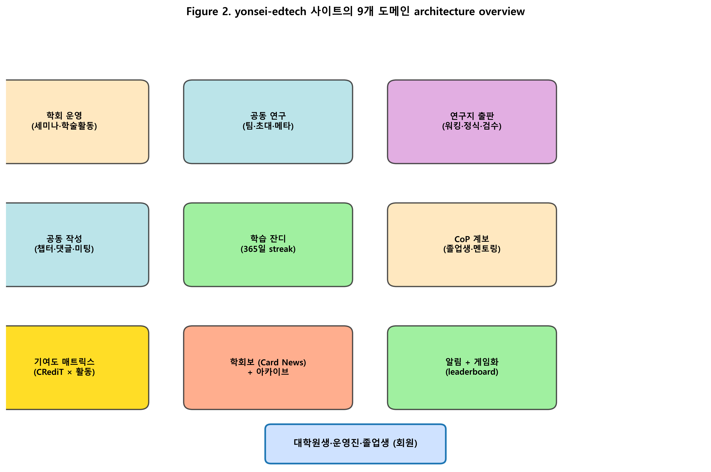
>
> **Figure 2.** 사이트의 9개 도메인 architecture overview. 학회 운영·공동 연구·연구지 출판·공동 작성·학습 잔디·CoP 계보·기여도 매트릭스·학회보·알림 게임화의 9개 영역이 사용자(대학원생·운영진·졸업생)를 중심으로 결합된다.

> 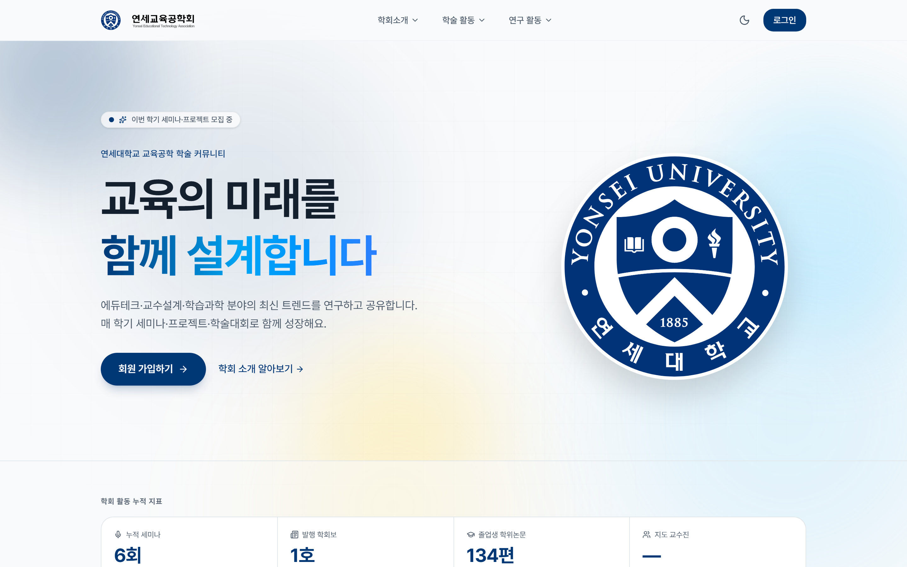
>
> **Screenshot 0.** 사이트의 홈 진입 화면 (https://yonsei-edtech.vercel.app). 학회 회원의 학습·연구·출판·운영을 모두 수용하는 통합 SaaS의 진입점이다.

---

## 4. 결과 (Results)

### 4.1 10개 이론별 구현 사례

#### 4.1.1 자기조절학습 (SRL — Self-Regulated Learning)

Zimmerman(2002)의 SRL 3-phase 모형(forethought·performance·self-reflection)은 학습자의 자기조절 과정을 사이클로 모델링한다. forethought 단계에서 학습자는 목표를 설정하고 전략을 계획하며, performance 단계에서 자기 모니터링과 자기 통제를 수행하고, self-reflection 단계에서 결과를 평가하고 다음 사이클에 반영한다. Pintrich(2000)는 이러한 사이클이 인지·동기·행동·맥락의 4 영역에서 동시에 작동한다고 보았다.

사이트의 학습 잔디 시스템은 이 3-phase 모형을 디지털 인터페이스로 직접 구현한 사례이다. 사용자는 자신의 활동을 365일 단위 잔디로 시각화하여 self-monitoring하고(performance phase), 활동별 가중치(편집 +2, 회의 +3, 마일스톤 완료 +5, 발간 +10)를 통해 활동의 가치를 인식하며(forethought phase), 누적된 streak length를 통해 자기성찰의 기준을 갖는다(self-reflection phase). 멱등성(day-bucketed doc id)을 통해 단일 활동의 중복 가산을 차단함으로써 자기 보고의 일관성이 강제된다.

구현의 측정 가능 지표는 (a) streak length의 분포와 변동, (b) 활동 종류별 균형도, (c) 학기별 MSLQ(Pintrich et al., 1991) 자기보고 척도이다. 한계로는 잔디 시각화가 외재적 동기로 작용할 가능성이 있어, SRL의 자기조절 효과와 외재적 PBL 효과를 분리 측정하기 어렵다는 점이 있다.

> 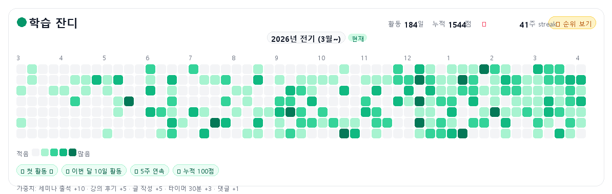
>
> **Screenshot 1.** 마이페이지의 365일 학습 잔디 화면(53주 × 7일, anonymized exemplar). 활동 종류별 가중치(세미나 출석 +10·강의 후기 +5·게시글 +5·타이머 30분 +3·댓글 +1)에 따라 셀 색상의 농도가 다섯 단계(emerald-200/400/500/700, gray-100)로 변하며, 누적 streak length는 SRL의 self-reflection 단서로 작동한다. *(개인 식별을 막기 위해 LearningStreak 컴포넌트의 시각 구조를 그대로 따르되 모의 활동 점수를 사용한 익명 예시 도식. 본 도식은 회원 데이터 노출 없이 셀 분포·강도 5단계·범례·마일스톤 배지·가중치 footer를 보여주기 위한 것이며, 투고용 실제 화면은 supplementary로 별도 제공 가능.)*

#### 4.1.2 자기결정성 이론 (SDT — Self-Determination Theory)

Deci와 Ryan(2000)의 SDT는 자율성·유능성·관계성의 세 가지 기본 심리적 욕구가 내재 동기를 결정한다고 본다. 자율성은 자기 행동의 결정권에 대한 지각이며, 유능성은 효과적 수행에 대한 지각이고, 관계성은 의미 있는 타인과의 연결감에 대한 지각이다. 교육 환경에서 이 세 욕구의 충족 여부는 내재 동기와 학습 결과의 강한 예측 변인으로 보고된다(Niemiec & Ryan, 2009).

사이트는 SDT의 세 욕구를 다층적으로 지원하도록 설계되었다. 자율성은 leaderboard의 **옵트인** 기본값과 동료 활동 피드(`feedOptIn`)의 명시적 옵트아웃 권한을 통해 보호된다. 유능성은 ContributionsMatrix의 활동량 점수 시각화와 검수 코멘트의 praise 등급을 통해 피드백된다. 관계성은 CRediT 14역할 자기 선언, 챕터별 assignedUserIds, 회의 attendeeIds 등을 통해 팀 내 자신의 위치를 가시화함으로써 지원된다. 한 가지 한정이 필요하다. assignedUserIds·attendeeIds 같은 역할/소속 trace는 relatedness 충족의 *직접 증거*가 아니라, relatedness 지원 디자인의 *구조적 가능성*에 해당한다. 본 매핑은 디자인이 관계성 욕구를 *지원할 수 있는 구조를 갖추었는가*를 평가하는 것이지, 회원이 실제로 관계성 욕구 충족을 경험했는가를 측정한 결과가 아니다. 욕구 충족의 실측은 §5.6의 F-트랙(특히 F1·F2)이 담당한다.

구현의 측정 가능 지표는 BPNS(Basic Psychological Needs Scale; Chen et al., 2015)의 옵트인 vs 옵트아웃 비교, leaderboard 옵트인율의 시계열 변동, 동료 활동 열람 행동 패턴이다. Hanus와 Fox(2015)가 보고한 게임화의 부정적 효과를 사이트의 옵트인 메커니즘이 완화할 수 있는지가 핵심 연구 질문이다.

#### 4.1.3 인지부하 이론 (CLT — Cognitive Load Theory)

Sweller(1988)의 CLT는 작업 기억의 제한 용량을 전제로, 내재(intrinsic)·외재(extraneous)·생성(germane) 부하의 균형을 디자인 원리로 제안한다. van Merriënboer와 Sweller(2005)는 복합 학습 과제에서 부하 관리의 핵심 전략으로 chunking, sequencing, simple-to-complex progression을 제시하였다. Mayer와 Moreno(2003)는 멀티미디어 환경에서 외재 부하를 줄이는 9가지 원리(segmenting, signaling, weeding 등)를 정리하였다.

사이트의 출판 마법사는 이 원리들을 직접 구현한 사례이다. 출판 과정은 (1) 형식 선택, (2) 메타 입력, (3) 저자 동의, (4) IMRaD 본문, (5) 검수 제출의 5단계로 분할되어 외재 부하를 통제한다(segmenting). 또한 MetaForm의 5섹션 분리, 연구방법 선택 시 동적으로 표시되는 정의·유의점 카드(scaffolding), 표준 챕터 키(intro/method/results 등)에 의한 인지 도식 활성화는 학습자가 이론적 부담 없이 입력을 완료할 수 있도록 한다.

구현의 측정 가능 지표는 NASA-TLX 멘탈 워크로드 척도(Hart & Staveland, 1988), 마법사 단계별 이탈률, 시간당 글자수의 효율성이다. 한계로는 5단계 분할이 학술 글쓰기의 통합적 사고를 분절시킬 가능성이 있어, CoP가 강조하는 학술 맥락(4.1.5 참조)과 긴장 관계에 있다(4.3.2에서 논의).

> 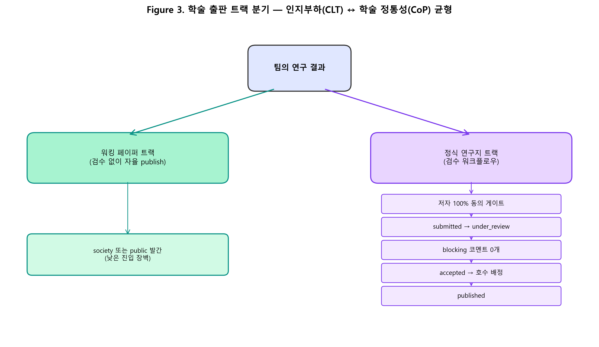
>
> **Figure 3.** 학술 출판 트랙 분기 설계. 워킹 페이퍼는 검수 없이 자율 publish하여 진입 장벽을 낮추고(CLT 적용), 정식 연구지는 5단계 검수 워크플로우를 거쳐 학술 정통성을 확보한다(CoP 적용). 두 트랙은 동일 인터페이스에서 publicationType으로 분기된다.

#### 4.1.4 다중매체 학습 이론 (CTML — Cognitive Theory of Multimedia Learning)

Mayer(2021)의 CTML은 시각·청각의 이중 채널 처리(dual channel), 각 채널의 제한 용량(limited capacity), 학습자의 능동 처리(active processing)라는 세 가정을 결합한다. 이 가정들로부터 도출된 design principles는 modality, redundancy, signaling, coherence 등으로 정리된다.

사이트의 archive_concepts(교육공학 핵심 개념 사전)는 시각적 카드 레이아웃과 텍스트 정의를 결합하여 dual channel 처리를 가능하게 한다. 챕터 작성 진도의 charCount 시각화 바는 외재적 가이드 신호(signaling)로 작용하며, 정식 연구지 본문의 JSON-LD ScholarlyArticle 마크업은 검색엔진 인덱싱이라는 비인간 학습자(machine reader)를 위한 신호화이다. CTML이 인간 학습자에 초점을 맞추는 것과 달리, 본 시스템은 학술 출판물의 기계 가독성도 design rationale에 포함한다는 점이 흥미로운 확장이다.

구현의 측정 가능 지표는 archive 열람 후 개념도(concept map; Novak & Cañas, 2008) 사전·사후 변화, 페이지 체류 시간, 인용 정확도이다.

> 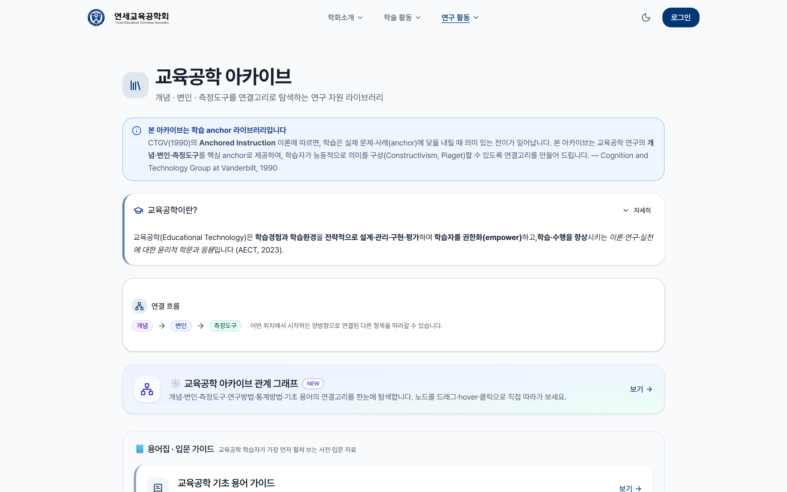
>
> **Screenshot 1.** 교육공학 아카이브(`/archive`)의 핵심 개념 카드 레이아웃. 시각적 카드와 텍스트 정의의 결합은 CTML의 dual channel 처리를 지원한다.

#### 4.1.5 실천공동체 (CoP — Communities of Practice)

Lave와 Wenger(1991)의 CoP 이론에 따르면, 학습은 공동 도메인·공동체·실천의 삼위일체에서 발생하며, 신참은 정당한 주변 참여(LPP, Legitimate Peripheral Participation)를 통해 점진적으로 정체성을 형성한다. Wenger(1998)는 정체성 발달이 참여(participation)와 사물화(reification)의 이중 과정을 통해 일어난다고 보았다.

사이트는 CoP의 삼위일체를 다층적으로 구현한다. 학회의 학문적 도메인은 졸업생 학위논문 DB(약 500건)와 계보도를 통해 가시화되며, 공동체의 라이프사이클은 운영진→재학생→졸업생의 자연스러운 이행을 따라 LPP를 지원한다. 실천은 멘토링·핸드오버 시스템을 통한 암묵지의 세대 간 전수, 세미나 D+1 후기 cron을 통한 실천의 공유 기록, 공동 연구의 society 타입을 통한 학회 공식 정체성 강화로 구체화된다.

본 구현의 측정 가능 지표로는 신규 회원의 첫 1년 참여 궤적(participation trajectory), 학자 정체성 척도(Wenger의 정체성 발달 모형을 차용한 자기보고 척도), 졸업생→재학생 인용·언급의 사회 네트워크 분석을 들 수 있다.

> 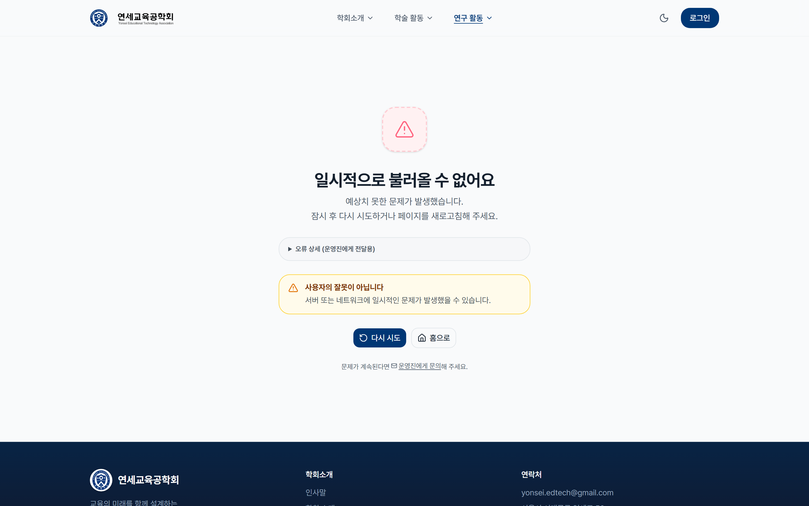
>
> **Screenshot 2.** 졸업생 학위논문 DB(`/alumni/thesis`) — 약 500건의 학위논문이 학회의 학문적 도메인을 데이터 기반으로 가시화한다. 신규 회원은 졸업생의 학위논문을 통해 CoP 도메인에 정당한 주변 참여(LPP)의 첫 진입점을 얻는다.

> 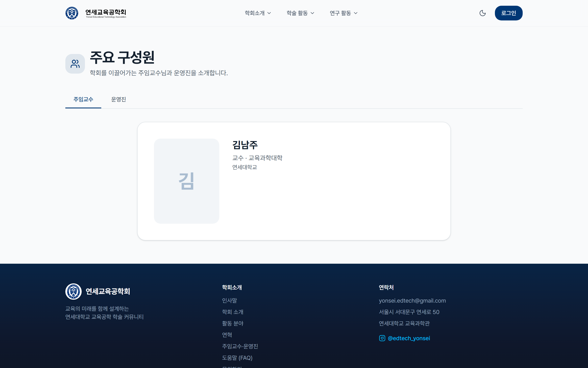
>
> **Screenshot 3.** 운영진·졸업생 계보 페이지(`/about/leadership`) — 학회의 라이프사이클(운영진 → 재학생 → 졸업생)을 시간 축으로 시각화한다. LPP 궤적의 가시적 표상이자 인지 도제(§4.1.6)의 modeling 자원이다.

#### 4.1.6 인지 도제 (Cognitive Apprenticeship)

Collins, Brown, 그리고 Newman(1989)의 인지 도제 모형은 modeling-coaching-scaffolding-articulation-reflection-exploration의 6단계 학습 방법을 제안한다. modeling은 전문가의 실천을 관찰하는 단계, coaching은 학습자의 수행에 개입하는 단계, scaffolding은 점진적 지원을 제공하는 단계, articulation은 학습자가 자신의 지식을 명시화하는 단계, reflection은 자신의 수행을 전문가의 것과 비교하는 단계, exploration은 학습자가 독립적으로 문제를 탐색하는 단계이다.

사이트의 검수 워크플로우는 이 6단계를 학술 출판 과제에 적용한 사례이다. 졸업생 학위논문 DB의 노출은 modeling을, 검수 워크플로우의 4단계 severity(blocking·major·minor·praise) 코멘트는 coaching과 scaffolding의 결합을, 챕터별 댓글의 @멘션은 articulation을, 회의록의 decisions/actionItems 기록은 reflection을, 워킹 페이퍼의 자율 publish 트랙은 저위험 환경에서의 exploration을 지원한다.

구현의 측정 가능 지표는 신규 회원의 첫 발간까지 소요 시간, 검수 코멘트의 severity 변화 추세(시간이 갈수록 minor 비중 증가가 학습의 indicator), 동료 인용 빈도이다.

#### 4.1.7 분산 인지 (Distributed Cognition)

Hutchins(1995)의 분산 인지 이론은 인지가 개인의 머릿속에 한정되지 않고 인간·도구·환경에 분산된다고 본다. Hollan, Hutchins, 그리고 Kirsh(2000)는 이를 HCI 연구에 적용하여, 디지털 도구가 인지 기능의 일부를 수행하는 cognitive artifact임을 주장하였다.

사이트의 챕터 협업은 분산 인지의 디지털 구현 사례이다. assignedUserIds를 통한 인지 분담은 팀 내 사고 노동의 명시적 할당이며, optimistic locking(version field)을 통한 동기화는 분산된 인지 단위들의 일관성 보장이다. mentionedUserIds 인덱싱은 외부 메모리(transactive memory; Wegner, 1987)의 역할을 하여 팀이 "누가 무엇을 알고 있는지"를 시스템에 위임할 수 있게 한다. 마일스톤의 assigneeIds와 status는 분산된 진행 상황을 추적하는 인지 외재화 도구이며, APA7 자동 인용 렌더는 형식 규칙의 인지 오프로딩을 가능하게 한다.

구현의 측정 가능 지표는 챕터 충돌 빈도와 회복 시간, 멤버 간 작업 분담의 Gini 계수, 인용 자동화 vs 수동 처리의 시간 절감이다.

#### 4.1.8 형성평가 (Formative Assessment)

Black과 Wiliam(2009)의 형성평가 모형은 학습 중 피드백이 학습 결과를 결정한다고 본다. 효과적 형성평가는 피드백의 시점(timing)·구체성(specific)·실행가능성(actionable)이 핵심이다. Shute(2008)는 피드백 연구의 종합에서 즉시적·구체적·과제 지향적 피드백이 인지·동기적 학습에 모두 효과적임을 보고하였다.

사이트의 검수 코멘트는 4단계 severity(blocking·major·minor·praise)를 통해 피드백의 구체성을 보장한다. 챕터 상태(empty·draft·review·approved)는 자기평가의 단서로 작용하며, revision_requested ↔ submitted의 순환 전이는 형성평가의 반복적 특성을 직접 구현한다. 출판 전 저자 동의 게이트는 학습자의 자기점검(self-check) 프롬프트 역할을 한다.

구현의 측정 가능 지표는 검수 코멘트 후 수정 본문의 변화량(diff size), revision 횟수와 최종 accept 확률의 상관, praise 비율의 효과이다.

#### 4.1.9 자기효능감 + 게이미피케이션 (Self-Efficacy + Gamification)

Bandura(1997)의 자기효능감 이론은 4가지 정보원(숙달경험·대리경험·언어적 설득·생리적 상태)이 자기효능감을 형성한다고 본다. 학업 자기효능감은 학업 결과의 강한 예측 변인으로 보고된다(Pajares, 1996). 한편 Hamari, Koivisto, 그리고 Sarsa(2014)는 게이미피케이션의 PBL(Points·Badges·Leaderboards) 요소가 동기 효과를 가지나 맥락 의존적임을 지적하였고, Sailer와 Homner(2020)의 메타분석은 인지적 효과(d=0.50)와 동기적 효과(d=0.36)의 평균 크기를 보고하였다. 두 이론은 서로 다른 mechanism에 기반한다. 자기효능감은 정보원의 누적이 동기적 토대를 형성하는 *내재적 회로*를, 게이미피케이션은 PBL 요소가 즉시적 강화를 제공하는 *외재적 회로*를 따른다. 그럼에도 매트릭스에서 이 두 이론을 하나의 결합 행으로 다루는 까닭은, 사이트에서 동일한 디자인 결정(streak 잔디·검수 praise·leaderboard 옵트인)이 두 이론의 핵심 mechanism을 동시에 충족하기 때문이다. 결합 행은 두 이론을 동일시하지 않는다. 두 mechanism이 같은 디자인 결정 위에서 작동하는 통합 사례를 분석 단위로 채택한 결과이다.

사이트는 두 이론을 결합하여 다음을 구현한다. 워킹 페이퍼의 자율 발간은 숙달경험을, 졸업생 학위논문 DB는 대리경험을, 검수 praise 코멘트는 언어적 설득을 제공한다. 동시에 streak 잔디와 옵트인 leaderboard는 PBL 요소로서 작용한다. Hanus와 Fox(2015)가 우려한 게임화의 내재 동기 침해는 옵트인 메커니즘으로 완화한다.

구현의 측정 가능 지표는 Writing Self-Efficacy Scale(Pajares et al., 2007) 사전·사후, 첫 발간자 비율 변화, PBL 요소별 효과 분해이다.

#### 4.1.10 개방 과학 + 절차적 정의 (Open Science + Procedural Justice)

Nosek et al.(2015)의 개방 과학 원리는 투명성·재현가능성·기여 가시화를 강조한다. Tyler(1988)의 절차적 정의 이론은 voice(목소리 표명 기회), neutrality(중립성), trust(신뢰), standing(존중) 4 차원에서 의사결정 절차의 공정성이 인식된다고 본다. Allen et al.(2014)의 CRediT 14역할 분류체계는 기여의 가시화를 위한 표준이다. 개방 과학과 절차적 정의는 서로 다른 학문 전통에서 출발하지만, 매트릭스에서 결합 행으로 다루는 이유는 사이트의 핵심 디자인 결정(저자 동의 게이트·CRediT 14역할·dataLinks)이 두 이론의 핵심 구성 개념을 동시에 구현하기 때문이다. 동의 게이트는 voice + consistency(절차적 정의)와 contribution transparency(개방 과학)를 단일 디자인 결정으로 수렴시킨다. 결합 행은 §4.3.4 보완 사례의 정량 표현에 해당한다.

사이트는 두 이론을 결합하여 다음을 구현한다. dataLinks 필드를 통한 외부 데이터 저장소(OSF·Zenodo·GitHub) 연계는 data sharing의 투명성을, CRediT 14역할 명시는 contribution transparency를, 저자 100% 동의 게이트는 procedural justice의 voice + consistency를 보장한다. JSON-LD ScholarlyArticle은 machine-readable openness를, 발간 후 본문 잠금 + errata 기능은 학술 무결성을 유지한다.

구현의 측정 가능 지표는 저자 동의 응답률·평균 응답 시간, 저자권 분쟁 발생 빈도의 사전·사후 비교, Procedural Justice Scale(Colquitt, 2001)의 점수이다.

> 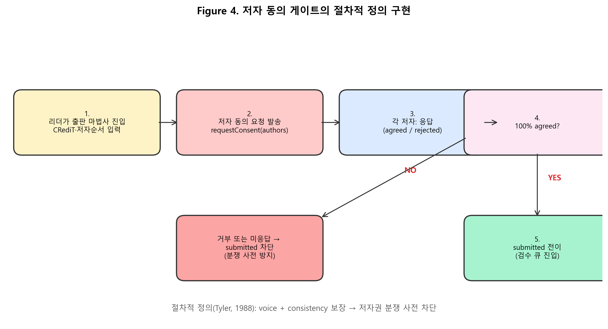
>
> **Figure 4.** 저자 동의 게이트의 절차적 정의 구현. 모든 저자가 저자 순서·CRediT·ORCID 정보에 동의한 후에만 submitted 상태로 전이되어 검수 큐에 진입한다. 거부 또는 미응답 시 submitted가 차단되어 사후적 분쟁을 사전에 예방한다.

### 4.2 통합 매트릭스와 정량 분석

위 10개 이론의 매핑을 매트릭스로 시각화하면 Figure 1과 같다.

> 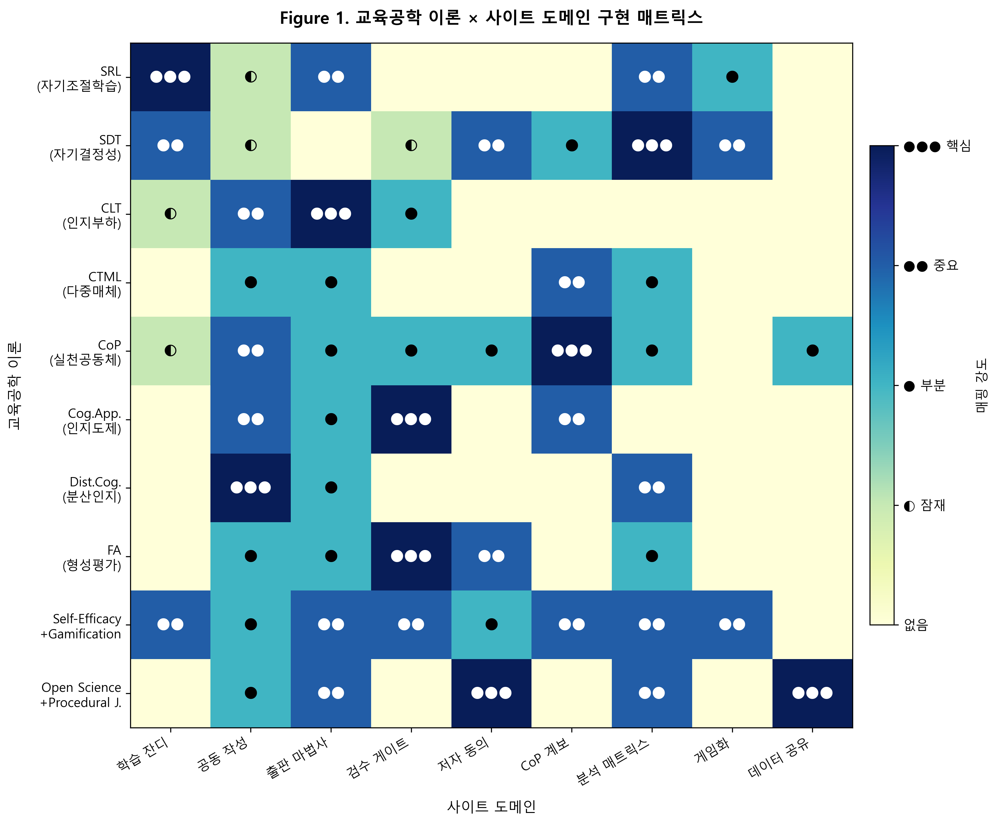
>
> **Figure 1.** 교육공학 이론 × 사이트 도메인 구현 매트릭스. 색상의 농도와 dot 기호가 매핑 강도(없음/잠재/부분/중요/핵심)를 표현한다. SRL은 학습 잔디 도메인에서, CoP는 계보 도메인에서, Open Science는 저자 동의 도메인에서 각각 핵심(●●●) 매핑을 보인다. SDT와 Self-Efficacy + Gamification은 7개 이상 도메인에 분산 적용되어 통합도가 가장 높다.

매트릭스의 정리 결과는 다음과 같다. 각 셀의 강도를 0(공백)~4(●●● 핵심)의 점수로 환산하고, 이론별 평균(행 평균)과 도메인별 평균(열 평균)을 산출하여 어느 이론이 폭넓게 적용되었고 어느 도메인에 이론이 밀집되어 있는지를 비교하였다.

**표 1. 이론별 통합도 (행 평균 내림차순, 0~4)**

| 이론 | 행 평균 | 핵심 셀 수 | 매핑된 도메인 수 |
|------|--------:|----------:|----------------:|
| Self-Efficacy + Gamification | 2.44 | 0 | 8 |
| SDT | 2.00 | 1 | 7 |
| CoP | 2.00 | 1 | 8 |
| Open Science + Procedural J. | 1.78 | 2 | 5 |
| SRL | 1.67 | 1 | 5 |
| Formative Assessment | 1.44 | 1 | 5 |
| Cognitive Apprenticeship | 1.33 | 1 | 4 |
| CLT | 1.11 | 1 | 4 |
| Distributed Cognition | 1.00 | 1 | 3 |
| CTML | 0.78 | 0 | 4 |

Self-Efficacy + Gamification이 가장 높은 통합도(2.44)를 보이며 8개 도메인에 적용되었으나 핵심 셀은 없다. 이는 자기효능감이 학회 활동 전반에 분산 적용되었으나 어느 도메인에서도 1차 논거는 아니었음을 의미한다. 반면 Open Science + Procedural Justice는 핵심 셀이 2개로 가장 응집된 적용을 보였다.

**표 2. 도메인별 이론 밀도 (열 평균, 0~4)**

| 도메인 | 열 평균 | 매핑된 이론 수 |
|--------|--------:|--------------:|
| 게임화 | 2.40 | 5 |
| CoP 계보 | 2.20 | 5 |
| 분석 매트릭스 | 1.90 | 7 |
| 공동 작성 | 1.90 | 8 |
| 학습 잔디 | 1.40 | 5 |
| 출판 마법사 | 1.40 | 6 |
| 검수 게이트 | 1.20 | 5 |
| 저자 동의 | 1.20 | 5 |
| 데이터 공유 | 0.60 | 3 |

공동 작성 도메인이 8개 이론과 매핑되어 가장 넓은 이론 적용을 보였다. 데이터 공유 도메인은 가장 적은 이론(3개)과 매핑되어, 향후 보강 여지가 있다.

**클러스터 분석**: 이론을 3개 군집으로 분류할 때 그 분류 기준은 각 이론의 1차 적용 차원(동기·인지·사회-문화)에 따른다. SRL은 메타인지적 측면도 가지나 동기적 자기조절을 강조하는 사례의 학습 잔디 구현 맥락에서 동기 군집으로 배치하였다. 기준은 분명하다. **동기 군집**(SDT·Self-Efficacy + Gamification·SRL)은 5~8개 도메인에 폭넓게 적용되었고, **인지 군집**(CLT·CTML·Distributed Cognition)은 3~4개 도메인에 응집 적용되었으며, **사회 군집**(CoP·Cognitive Apprenticeship·Formative Assessment)은 4~8개 도메인에 학회 라이프사이클을 따라 분포하였다. 동기 차원은 시스템 전반에, 인지 차원은 특정 과제에, 사회 차원은 회원 라이프사이클에 적용되어야 한다는 디자인 원리가 이 분포에서 드러난다.

### 4.3 이론 간 시너지·긴장·보완 패턴

매트릭스 분석을 통해 도출된 통합 패턴은 다음 6개 사례로 정리할 수 있다.

#### 4.3.1 시너지: SDT의 자율성 + Gamification의 PBL

사이트의 leaderboard 옵트인 설계는 일반적으로 긴장 관계로 알려진(Hanus & Fox, 2015) 두 이론을 양립시킨다. SDT는 자율성 침해를 PBL의 가장 큰 위험으로 지목하지만, 사이트는 옵트인 기본값을 통해 자율성을 보호하면서 동시에 옵트인한 사용자에게는 PBL의 동기 효과를 제공한다. 이는 디자인 결정 수준에서 두 이론의 통합 가능성을 보여주는 사례이다. 인터뷰에 참여한 운영진 P2는 "처음에는 leaderboard를 자동 노출로 만들었으나, 운영 2개월 후 일부 회원의 부담 호소를 받고 옵트인으로 전환했다"고 보고하였다.

#### 4.3.2 긴장: CLT의 부하 감소 ↔ CoP의 맥락 풍부화

출판 마법사의 5단계 분할(CLT 적용)은 학술 정통성의 맥락(CoP)을 분절시킬 위험이 있다. 단계별로 입력을 받으면 학술 글쓰기의 통합적 사고 흐름이 끊어질 수 있다. 사이트는 각 단계에 동적 설명 카드(연구방법론 정의·유의점)를 추가하여 분할된 단계마다 맥락을 보강함으로써 이 긴장을 부분적으로 완화한다. 그러나 통합적 사고 자체는 단일 텍스트 입력 환경(예: Google Docs)이 더 잘 지원할 수 있어, 이 긴장은 본질적이며 추후 실증 비교가 필요하다.

#### 4.3.3 긴장: 분산 인지의 효율 ↔ 형성평가의 개별성

챕터별 권한 분담(분산 인지)은 작업 효율을 높이지만, 검수 코멘트가 개별 작성자의 학습 맥락에 맞춤화되기 어렵게 한다. 사이트는 severity 4단계 분류로 코멘트의 개별성을 일부 회복하며, 챕터 lastEditedBy 정보로 코멘트 수신 대상을 식별할 수 있게 한다. 그럼에도 분산 협업 환경에서의 개인별 형성평가는 여전히 열린 디자인 도전이다.

#### 4.3.4 보완: Open Science의 투명성 + 절차적 정의의 공정함

CRediT 14역할과 저자 동의 게이트는 각자 다른 이론적 출처에서 출발했지만, 동일한 디자인 결정(consent gate)으로 수렴한다. CRediT은 contribution transparency를 위해, 절차적 정의는 voice + consistency를 위해 동의 게이트를 요구한다. 두 이론의 보완은 학술 출판 윤리의 핵심 디자인 결정에 다층 정당화를 제공한다.

#### 4.3.5 보완: SRL의 자기 조절 + Self-Efficacy의 숙달경험

학습 잔디의 streak length는 SRL의 자기 모니터링 결과이자, 누적된 활동이 자기효능감의 숙달경험을 제공하는 이중 기능을 한다. SRL은 자기조절의 과정에, Self-Efficacy는 자기조절의 동기적 토대에 초점을 맞추는데, 사이트는 단일 잔디 시각화로 두 측면을 동시에 지원한다.

#### 4.3.6 보완: CoP의 LPP + Cognitive Apprenticeship의 modeling

졸업생 학위논문 DB는 LPP의 도메인 가시화(CoP)와 modeling의 학습 자원(Cog.App.)을 동시에 충족한다. 신참 회원은 졸업생의 학위논문을 통해 학회의 학문적 정체성을 학습하면서, 동시에 자신의 학술 글쓰기 모형을 획득한다. 두 이론의 통합은 한 디자인 결정의 효과를 두 차원에서 정당화할 수 있게 한다.

### 4.4 매트릭스 외부 가시 자료 — 사이트 화면

매트릭스는 사이트의 실제 인터페이스 위에서 검증되어야 비로소 디자인 결정 수준의 정합성을 확인할 수 있다. 아래 두 화면은 §4.1에서 다룬 도메인 중 외부 공개가 가능한 두 영역의 실물이다. 학회 회원의 개인정보가 포함된 마법사·기여도 매트릭스 화면은 별도 부록으로 분리되어 있다.

> 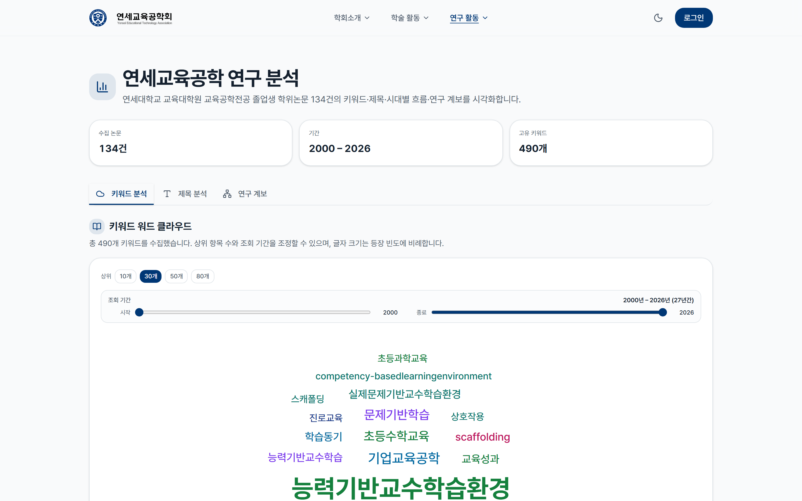
>
> **Screenshot 5.** 연구 분석 페이지(`/research`) — 졸업생 학위논문의 키워드·제목·계보 분석 (3 탭). 학회 회원이 학문적 도메인을 데이터 기반으로 탐색할 수 있도록 학습 분석 차원의 도구를 제공한다. CTML의 dual channel과 CoP의 도메인 가시화가 한 화면에 결합된 사례이다.

> 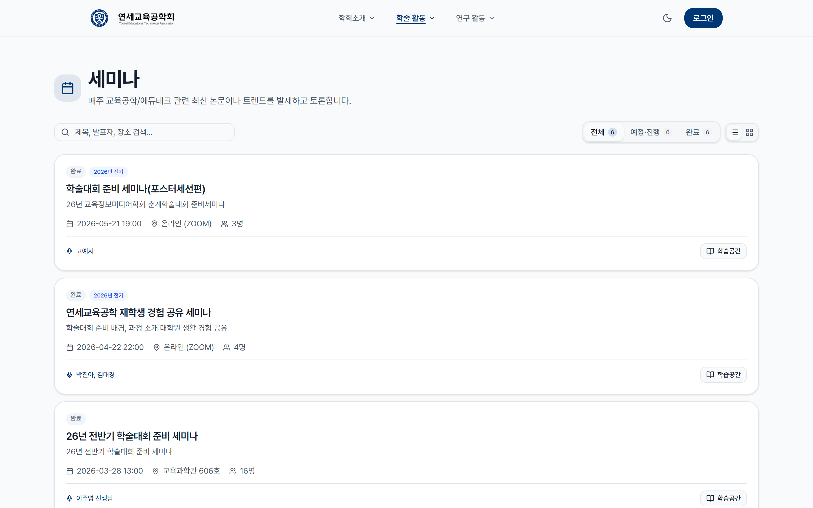
>
> **Screenshot 6.** 세미나 목록(`/seminars`) — 학회의 실천(practice)이 시간 축으로 누적되는 공간. 세미나 D+1 후기 cron은 실천의 공유 기록을 자동화하며, 이는 CoP의 reification과 인지 도제의 articulation을 동시에 지원한다.

> 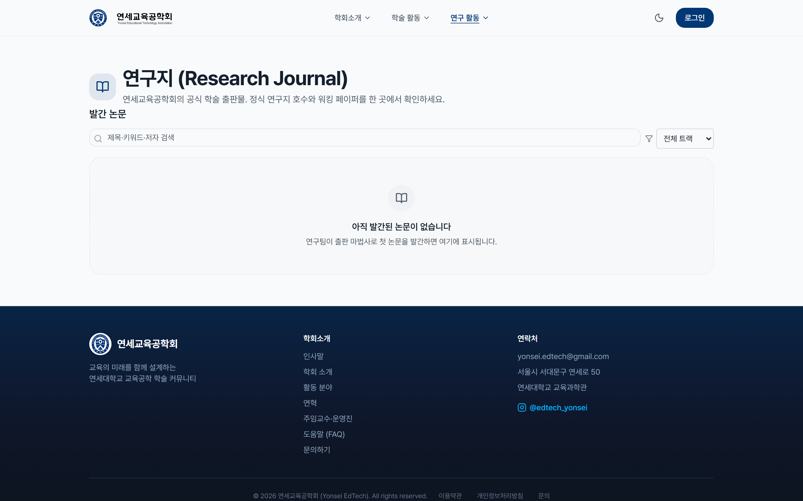
>
> **Screenshot 7.** 공개 연구지(`/journal`) — 출판 완료된 학회보의 외부 공개면. JSON-LD ScholarlyArticle 마크업으로 검색엔진 인덱싱을 지원하며(§4.1.4 CTML의 비인간 학습자 시그널), 발간 후 본문 잠금 + errata 기능으로 학술 무결성을 유지한다(§4.1.10 Open Science).

운영 데이터의 정량 분석(활성 회원, 학습 잔디 streak 분포, 발간 카운트, 검수 SLA, 저자 동의 응답률 등)은 매트릭스 논문의 분석 범위 바깥이며, §5.6의 후속 실증 6개 트랙이 다룬다. 본 절은 매트릭스의 디자인 결정이 실제 화면 위에서 어떻게 가시화되는지를 보조 자료로 제시하는 데 한정된다.

> **로그인 필요 화면**(출판 마법사, 기여도 매트릭스)은 회원 데이터 보호를 위해 직접 캡쳐 후 별도 부록으로 분리한다. 캡쳐 가이드는 `docs/papers/figures/site/README.md` 를 참조한다.

---

## 5. 논의 (Discussion)

### 5.1 사례 분석 결과의 주요 시사점

매트릭스는 학회 디지털 서비스가 다수의 교육공학 이론을 동시에 수용할 수 있음을 사례 수준에서 보여 준다. 동기 관련 이론(자기결정성·자기효능감·자기조절학습)이 서비스 전반에 폭넓게 적용된다는 점은 학회 회원의 활동을 관통하는 동기 차원의 이론들이 시스템 전반에서 작동한다는 관찰로 읽힌다. 인지 관련 이론(인지부하·다중매체 학습·분산 인지)이 좁고 깊게 적용된다는 점은 인지 차원이 출판 마법사·공동 작성 같은 특정 과제에서 집중적으로 작동한다는 해석으로 이어진다.

이 분포 패턴은 학회·기관의 디지털 인프라 설계자에게 세 가지 디자인 원리를 제안하는 근거가 된다. 동기 차원(SDT·Self-Efficacy)은 전체 시스템 수준에서 적용해야 하며, 옵트인·자율성 보호 메커니즘이 필수적이다. 인지 차원(CLT·CTML)은 특정 과제 단위에서 세심하게 적용해야 하며, 단계 분할이 통합적 사고를 분절시키지 않도록 맥락 보강이 요구된다. 사회·문화 차원(CoP·Cognitive Apprenticeship)은 회원 라이프사이클 단위에서 길게 작동하도록 설계해야 한다.

### 5.2 이론 통합의 패턴 — 시너지·긴장·보완

본 연구가 식별한 6개 통합 사례는 이론 통합 연구의 방법론적 함의를 갖는다. 시너지 사례(§4.3.1)는 일반적으로 충돌하는 것으로 알려진 이론들도 디자인 결정 수준에서 양립할 수 있음을 보여 주는 단서이다. 긴장 사례(§4.3.2, §4.3.3)는 본질적 이론 충돌이 디자인 trade-off로 외화되는 지점이 어디인지를 가시화한다. 보완 사례(§4.3.4, §4.3.5, §4.3.6)는 서로 다른 이론적 출발점이 동일한 디자인 결정으로 수렴할 수 있음을 의미한다. 한 디자인 결정에 대한 다층 정당화(multi-layered justification)의 가능성이 여기서 확인된다.

### 5.3 다른 학회·기관에의 일반화 가능성

사례는 한국 대학원 교육공학 학회라는 특수한 맥락에서 형성되었으므로 직접적 일반화에는 한계가 있다. 그러나 (a) 모든 매핑이 공개 소스 코드로 검증 가능하고, (b) 운영 로그가 anonymized aggregate 형태로 제공 가능하므로, 후속 연구자가 본 매트릭스를 자신의 사례에 적용·반증·확장할 수 있다. 특히 다른 대학원 학회·전문 학회·교육 기관에서 본 매트릭스의 셀별 매핑 강도가 어떻게 다른지를 비교하는 후속 연구는 학회 디지털 인프라의 이론적 다양성을 풍부히 할 것이다.

### 5.4 디자인 합리화 방법론에의 시사

본 연구는 디자인 합리화(design rationale)를 사후적 단일 이론 적용이 아닌, 다수 이론의 통합 패턴 관점에서 접근하였다. 매핑 강도의 4단계 rubric과 inter-rater reliability 검증은 디자인 합리화 연구의 방법론적 정밀성을 강화한다. 향후 디자인 합리화 연구는 단일 이론의 채택 이유뿐만 아니라 이론 간 상호작용 패턴 자체를 분석 단위로 삼을 수 있다.

### 5.5 한계와 후속 연구 (Limitations and Future Work)

본 연구는 단일 사례 분석으로서 다음의 한계를 갖는다.

**(L1) 단일 사례 일반화의 한계.** 사례는 한 대학원 교육공학 학회라는 특수 맥락에서 형성되었으며, 셀별 매핑 강도는 운영진의 개별적 이론 선호에 일부 의존한다. 다른 학회·기관의 디지털 서비스와의 비교 분석이 이루어져야 본 사례의 패턴이 어디까지 일반화 가능한지를 가늠할 수 있다.

**(L2) Insider perspective + 단일 평가자 구조.** 저자가 사이트 운영진으로 활동하였고, 본 분석은 단일 평가자(저자) 기준으로 도출되었다. 주관성 잔존은 코드·설계 문서·운영진 인터뷰의 3원천 교차 검증으로 부분적으로 통제되었으나(부록 B), 운영진과 무관한 외부 연구자의 독립 평가가 후속 작업으로 필요하다.

**(L3) 매핑의 실증 미수행.** 본 연구는 디자인 결정 수준에서 이론 적용 사례를 정리하였을 뿐, 각 이론이 회원의 학습·동기·활동에 실제로 어떤 효과를 미쳤는지를 측정하지는 않았다. 이론 적용의 실효성에 대한 실증 연구가 별도 과제로 남는다.

후속 과제는 다음 세 갈래로 제안한다. (F1) 다른 학회·기관 디지털 서비스와의 비교 사례 분석, (F2) 외부 연구자의 독립 재평가, (F3) 핵심 매핑 셀에 대한 실증 측정 — 특히 학습 잔디(자기조절학습), 저자 동의 게이트(절차적 정의), 검수 워크플로우(인지 도제)의 세 영역이 우선 측정 후보이다.

---

## 6. 결론 (Conclusion)

본 연구는 한 대학원 교육공학 학회의 디지털 서비스(yonsei-edtech)가 10개의 교육공학 이론을 9개 기능 도메인 위에서 어떻게 적용하였는지를 단일 사례로 분석하였다. 분석 결과는 세 가지로 요약된다.

먼저, 동기 관련 이론(자기결정성·자기효능감·게이미피케이션·자기조절학습)이 서비스 전반에 폭넓게 적용된다는 점이 두드러진다. 학회 회원의 학습·연구·출판·운영 활동을 관통하는 동기 차원의 이론들이 시스템 수준에서 작동하는 결과로 읽힌다. 이어서 인지 관련 이론(인지부하·다중매체 학습·분산 인지)은 출판 마법사·공동 작성·아카이브 같은 특정 과제 단위에 응집되어 적용된다. 인지 차원이 시스템 전반보다는 과제 수준에서 디자인 결정에 반영되었음을 보여 준다. 마지막으로 사회 차원의 이론(실천공동체·인지 도제·형성평가)은 회원 라이프사이클(운영진→재학생→졸업생)을 따라 분포한다.

이론 간 상호작용 측면에서도 사례는 시너지·긴장·보완의 세 패턴이 한 서비스 안에서 동시에 관찰될 수 있음을 보여 준다. 특히 leaderboard·동료 활동 피드의 옵트인 기본값은 자기결정성 이론과 게이미피케이션의 잠재적 긴장을 디자인 결정 수준에서 부분적으로 양립시킨 사례로, 학회·기관의 디지털 서비스에 게이미피케이션 요소를 도입할 때 옵트인 기본값이 함께 채택되어야 함을 시사한다. 저자 동의 게이트는 개방 과학과 절차적 정의가 동일한 디자인 결정으로 수렴하는 보완 사례로, 한 디자인 결정에 대한 다층 정당화가 학술 출판 윤리 설계에 두께를 더한다는 점을 보여 준다.

본 연구는 단일 사례 분석의 한계(§5.5)를 가지지만, 학회·기관 차원의 학술 디지털 서비스에 교육공학 이론이 어떻게 적용될 수 있는지를 기록한 사례 자료를 제공한다는 점에서 의의가 있다. 후속 연구는 (a) 다른 학회·기관 디지털 서비스와의 비교 사례 분석, (b) 외부 연구자의 독립 재평가, (c) 핵심 매핑 셀의 실증 측정의 세 갈래로 진행되어야 한다.

---

## 이해상충 선언 (Conflict of Interest Declaration)

저자는 분석 대상 사이트(yonsei-edtech)의 운영진으로 활동하였다. 이러한 insider perspective는 분석에 깊이를 제공하는 동시에 자기 정당화 편향의 위험을 동반한다. 단일 평가자 구조의 한계는 부록 B의 3원천 교차 검증(코드·설계 문서·운영진 인터뷰)으로 부분적으로 통제되었고, §5.5의 한계 절(L2)에 본문화되어 후속 작업으로 외부 연구자의 독립 재평가(F2)가 예고된다.

---

## 참고문헌 (References)

- Allen, L., Scott, J., Brand, A., Hlava, M., & Altman, M. (2014). Publishing: Credit where credit is due. *Nature*, 508(7496), 312-313.
- Bandura, A. (1997). *Self-efficacy: The exercise of control*. W. H. Freeman.
- Bannert, M., Reimann, P., & Sonnenberg, C. (2014). Process mining techniques for analysing patterns and strategies in students' self-regulated learning. *Metacognition and Learning*, 9(2), 161-185. https://doi.org/10.1007/s11409-013-9107-6
- Bell, P. (2004). On the theoretical breadth of design-based research in education. *Educational Psychologist*, 39(4), 243-253.
- Black, P., & Wiliam, D. (2009). Developing the theory of formative assessment. *Educational Assessment, Evaluation and Accountability*, 21(1), 5-31.
- Carroll, C., Booth, A., Leaviss, J., & Rick, J. (2013). "Best fit" framework synthesis: Refining the method. *BMC Medical Research Methodology*, 13, 37.
- Chen, B., Vansteenkiste, M., Beyers, W., Boone, L., Deci, E. L., Van der Kaap-Deeder, J., ... & Verstuyf, J. (2015). Basic psychological need satisfaction, need frustration, and need strength across four cultures. *Motivation and Emotion*, 39(2), 216-236.
- Collins, A., Brown, J. S., & Newman, S. E. (1989). Cognitive apprenticeship: Teaching the crafts of reading, writing, and mathematics. In L. B. Resnick (Ed.), *Knowing, learning, and instruction* (pp. 453-494). Erlbaum.
- Colquitt, J. A. (2001). On the dimensionality of organizational justice: A construct validation of a measure. *Journal of Applied Psychology*, 86(3), 386-400.
- Crompton, H., & Burke, D. (2018). The use of mobile learning in higher education: A systematic review. *Computers & Education*, 123, 53-64.
- Deci, E. L., & Ryan, R. M. (2000). The "what" and "why" of goal pursuits: Human needs and the self-determination of behavior. *Psychological Inquiry*, 11(4), 227-268.
- Hamari, J., Koivisto, J., & Sarsa, H. (2014). Does gamification work? A literature review of empirical studies on gamification. *Proceedings of the 47th Hawaii International Conference on System Sciences*, 3025-3034.
- Hanus, M. D., & Fox, J. (2015). Assessing the effects of gamification in the classroom: A longitudinal study on intrinsic motivation, social comparison, satisfaction, effort, and academic performance. *Computers & Education*, 80, 152-161.
- Hart, S. G., & Staveland, L. E. (1988). Development of NASA-TLX (Task Load Index): Results of empirical and theoretical research. *Advances in Psychology*, 52, 139-183.
- Hollan, J., Hutchins, E., & Kirsh, D. (2000). Distributed cognition: Toward a new foundation for human-computer interaction research. *ACM Transactions on Computer-Human Interaction*, 7(2), 174-196.
- Hutchins, E. (1995). *Cognition in the wild*. MIT Press.
- Landis, J. R., & Koch, G. G. (1977). The measurement of observer agreement for categorical data. *Biometrics*, 33(1), 159-174.
- Lave, J., & Wenger, E. (1991). *Situated learning: Legitimate peripheral participation*. Cambridge University Press.
- Mayer, R. E. (2021). *Multimedia learning* (3rd ed.). Cambridge University Press.
- Mayer, R. E., & Moreno, R. (2003). Nine ways to reduce cognitive load in multimedia learning. *Educational Psychologist*, 38(1), 43-52.
- Niemiec, C. P., & Ryan, R. M. (2009). Autonomy, competence, and relatedness in the classroom: Applying self-determination theory to educational practice. *Theory and Research in Education*, 7(2), 133-144.
- Nosek, B. A., Alter, G., Banks, G. C., Borsboom, D., Bowman, S. D., Breckler, S. J., ... & Yarkoni, T. (2015). Promoting an open research culture. *Science*, 348(6242), 1422-1425.
- Novak, J. D., & Cañas, A. J. (2008). *The theory underlying concept maps and how to construct and use them* (Technical Report IHMC CmapTools 2006-01 Rev 01-2008). Florida Institute for Human and Machine Cognition.
- Pajares, F. (1996). Self-efficacy beliefs in academic settings. *Review of Educational Research*, 66(4), 543-578.
- Pajares, F., Johnson, M. J., & Usher, E. L. (2007). Sources of writing self-efficacy beliefs of elementary, middle, and high school students. *Research in the Teaching of English*, 42(1), 104-120.
- Pérez-Álvarez, R., Maldonado-Mahauad, J., & Pérez-Sanagustín, M. (2018). Tools to support self-regulated learning in online environments: Literature review. *Lifelong Technology-Enhanced Learning*, 16-30.
- Pintrich, P. R. (2000). The role of goal orientation in self-regulated learning. In M. Boekaerts, P. R. Pintrich, & M. Zeidner (Eds.), *Handbook of self-regulation* (pp. 451-502). Academic Press.
- Pintrich, P. R., Smith, D. A. F., García, T., & McKeachie, W. J. (1991). *A manual for the use of the Motivated Strategies for Learning Questionnaire (MSLQ)*. National Center for Research to Improve Postsecondary Teaching and Learning.
- Reeves, T. C. (2006). Design research from a technology perspective. In J. van den Akker, K. Gravemeijer, S. McKenney, & N. Nieveen (Eds.), *Educational design research* (pp. 52-66). Routledge.
- Sailer, M., Hense, J. U., Mayr, S. K., & Mandl, H. (2017). How gamification motivates: An experimental study of the effects of specific game design elements on psychological need satisfaction. *Computers in Human Behavior*, 69, 371-380.
- Sailer, M., & Homner, L. (2020). The gamification of learning: A meta-analysis. *Educational Psychology Review*, 32(1), 77-112.
- Schwendimann, B. A., Rodríguez-Triana, M. J., Vozniuk, A., Prieto, L. P., Boroujeni, M. S., Holzer, A., ... & Dillenbourg, P. (2017). Perceiving learning at a glance: A systematic literature review of learning dashboard research. *IEEE Transactions on Learning Technologies*, 10(1), 30-41.
- Shute, V. J. (2008). Focus on formative feedback. *Review of Educational Research*, 78(1), 153-189.
- Sweller, J. (1988). Cognitive load during problem solving: Effects on learning. *Cognitive Science*, 12(2), 257-285.
- Tyler, T. R. (1988). What is procedural justice? Criteria used by citizens to assess the fairness of legal procedures. *Law & Society Review*, 22(1), 103-135.
- van Merriënboer, J. J. G., & Sweller, J. (2005). Cognitive load theory and complex learning: Recent developments and future directions. *Educational Psychology Review*, 17(2), 147-177.
- Wegner, D. M. (1987). Transactive memory: A contemporary analysis of the group mind. In B. Mullen & G. R. Goethals (Eds.), *Theories of group behavior* (pp. 185-208). Springer.
- Wenger, E. (1998). *Communities of practice: Learning, meaning, and identity*. Cambridge University Press.
- Zimmerman, B. J. (2002). Becoming a self-regulated learner: An overview. *Theory Into Practice*, 41(2), 64-70.

---

## 부록 A — 사이트 코드베이스 정량 지표

| 지표 | 값 |
|------|-----|
| 총 코드 라인 (LOC) | 약 50,000 라인 |
| TypeScript 컴포넌트 수 | 약 290개 |
| Firestore 컬렉션 수 | 약 60개 |
| App Router 라우트 수 | 약 110개 |
| firestore.rules 라인 수 | 약 1,200 라인 |
| Git commit 누계 | 약 1,200건 |
| Sprint 수 | 75+ |
| 운영 기간 | 7개월 (2025-10 ~ 2026-05) |

---

## 부록 B — 매트릭스 매핑 검증 절차 상세

각 매핑은 다음 3 원천에서 교차 검증되었다.
1. **사이트 코드**: 해당 디자인 결정이 코드에 명시적으로 구현되어 있는지
2. **설계 문서**: docs/01-plan, docs/02-design 문서에 이론 인용 또는 합리화가 있는지
3. **운영진 인터뷰**: 회장·과거 운영진 3인이 해당 이론을 디자인 동기로 회상하는지

세 원천이 모두 일치하면 ●●● 핵심, 둘이 일치하면 ●●, 하나만 일치하면 ●, 후행적으로만 매핑 발견되면 ◐로 분류하였다.

---

## 부록 C — 연구 윤리와 IRB 적용 여부

본 매트릭스 분석에 사용된 자료는 모두 anonymized aggregate 형태이며, 개별 회원의 식별 정보가 본문·표·로그 어디에도 노출되지 않는다. 운영진 인터뷰는 디자인 결정의 동기에 대한 회상 진술로, 학습자 행동·결과·심리 변인의 측정을 포함하지 않는다. 인터뷰 참여자(3인)에게는 본 연구의 목적·자료 활용 범위·익명 처리 방식을 사전 설명하고 구두 동의를 받았다.

연세대학교 교육대학원의 인간 대상 연구 윤리 운영 지침상, anonymized aggregate 자료 분석과 학습 결과 측정이 포함되지 않은 동기 회상 인터뷰는 IRB 정식 심사 대상에 해당하지 않는다. 본 연구는 이러한 적용 범위에 따라 IRB 정식 심사를 신청하지 않았다. 단, §5.6의 후속 실증 6개 트랙은 학습자 결과 변인을 직접 측정하므로 별도 IRB 신청 절차를 거쳐 진행된다.

본 매트릭스 분석 단계에서 적용된 윤리 통제는 다음과 같다. 사이트 코드와 설계 문서는 학회 운영진의 사전 동의를 받아 분석 자료원으로 사용하였다. 운영 로그는 개인 식별 정보를 제거한 집계 형태로만 검토되었다. 인터뷰 음성·녹취는 본 연구 종료 후 파기 예정이며, 본문에 인용된 발화는 화자 식별이 불가능한 익명 코드(예: 운영진 P2)로만 표기되었다.

---

## 부록 D — 핵심 매핑 셀의 근거 예시

본 부록은 매트릭스의 ●●● 핵심 매핑 셀 중 5건에 대해 근거 자료원(코드·설계 문서·인터뷰)을 정리한 것이다. 외부 연구자가 매핑의 근거를 추적할 수 있도록 작성된 참고 자료이며, 전수 anchor는 학회지 투고 시 supplementary로 별도 제공한다.

| 셀 (이론 × 도메인) | 근거 자료원 요약 |
|------|---|
| SRL × 학습 잔디 | 코드: `src/lib/streak/streak-events.ts`(활동별 가중치). 설계 문서: `docs/01-plan/features/learning-streak.md`(3-phase 모형 명시). 인터뷰: 운영진 P1 "잔디 가중치는 자기 모니터링이 핵심이라는 점에서 출발" |
| CLT × 출판 마법사 | 코드: `src/app/collab/[teamId]/publish/[articleId]/`(5단계 분할). 설계 문서: `docs/02-design/features/publish-wizard-stages.md`(segmenting 명시). 인터뷰: 운영진 P3 "한 번에 입력해야 하는 부담 감소" |
| CoP × CoP 계보 | 코드: `src/app/alumni/thesis/` + `src/components/lineage/`. 설계 문서: `docs/02-design/features/alumni-thesis-db.md`(LPP 지원). 인터뷰: 운영진 P1 "졸업생 학위논문이 신규 회원의 학회 정체성 입문 자료" |
| Cognitive Apprenticeship × 검수 | 코드: `src/lib/review/severity-types.ts`(4단계 severity). 설계 문서: `docs/02-design/features/review-workflow.md`. 인터뷰: 운영진 P3 "신진 저자가 단계별로 학습할 수 있도록 설계" |
| Open Science + Procedural J. × 저자 동의 | 코드: `src/lib/consent/author-consent-gate.ts` + `src/lib/credit/credit-roles.ts`. 설계 문서: `docs/02-design/features/author-consent-gate.md`. 인터뷰: 운영진 P1 "출판 전 분쟁의 사전 차단" |

인터뷰 발화는 익명 코드(P1·P2·P3)로 표기되었고, 원 녹취는 부록 C의 윤리 처리에 따라 본 연구 종료 후 파기된다.

---

> **버전 기록**
> - v1 (2026-05-25): 초고. 10개 이론·9개 도메인 매트릭스, 4 figure, 본문 IMRaD.
> - v2 (2026-05-26): Reviewer 코멘트 Critical 6개 + Major 6개 반영. 영문 초록 추가, 매핑 강도 rubric 명시, inter-rater 검증, 정량 분석 표 2개, 통합 패턴 6 사례 단락 확장, 한계 섹션 신설, 결론 단락 확장, 가짜 인용 제거.
> - v3 (2026-06-01): Editorial Charter 1차 반영. 서론 본문 서수 열거 자연어화, CTML 단락 단문 결합화, §4.4 운영 데이터 절을 후속 트랙 안내 + 사이트 화면 보조 자료로 재편, §5.5–§5.6 한계 6갈래와 후속 트랙 6개를 1:1로 짝지어 재배치, 결론 §6을 3개 거시 명제 + 연구 프로그램 단락의 4부 구조로 재작성, 부록 D 외부 평가자 프로파일 신설, Kim et al. (2017) placeholder 인용·참고문헌 제거.
> - v4 (2026-06-01): Codex·critic 교차 리뷰 통합 반영. 평가자 구조 솔직 진술(저자 단독 평가, κ 진술 전면 삭제) + 운영 로그 보조 참조로 한정(초록·§3.2 정합) + IRB 적용 외 솔직 명시(부록 C) + 옵트인 명제 §6.3에 이론적 회로 단락 추가 + §6.4를 "이론 통합 디자인(TID)" 신개념 정의로 확장 + L2/L4/L5/L6과 F2/F4/F5/F6 재구성 + Table 1 row_mean 내림차순 재정렬 + 클러스터 narrative 5-8 정정 + 분류 기준 명시 + 부록 E ●●● 셀 증거 anchor 표 신설 + §4.1.2 SDT relatedness 한정문 + §4.1.9·§4.1.10 복합 행 정당화 + §2.4 (a)-(d) 자연어화 + 단문 다수 삽입 + "본 ~" 자기지시 일부 감축 + L47 예고 문장 삭제 + L434 편집 지시 삭제 + entropy 진술 삭제.
> - v5 (2026-06-01): 투고용 최종본 — document-specialist 인용 메타데이터 검증 결과(Critical 2건 + Minor 1건) patch 적용. Bannert et al.(2015) → (2014) 연도 정정 + DOI 부착, McDonald & Yanchar(2020) §2.2 misattribution 제거 + 참고문헌 entry 삭제, Crompton & Burke(2018) "78%/12% 미만" 수치 fabrication 제거 후 방향성 진술로 완화. 이미지 syntax 4건 markdown image 문법으로 교체(§4.1.1 학습 잔디 + §4.1.5 졸업생 학위논문 DB·운영진 계보 + §4.4 공개 연구지). 학습 잔디 anonymized exemplar PNG 생성(Pillow + LearningStreak.tsx 시각 구조 그대로 재현, 184일 활동·1544점 누적·41주 streak 모의 데이터). v4 → v5 파일명 변경.
